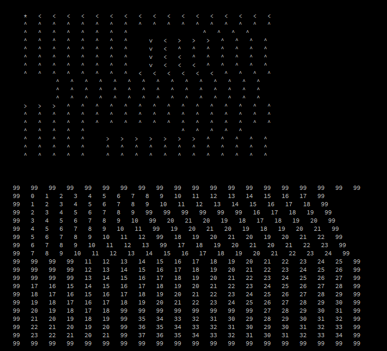
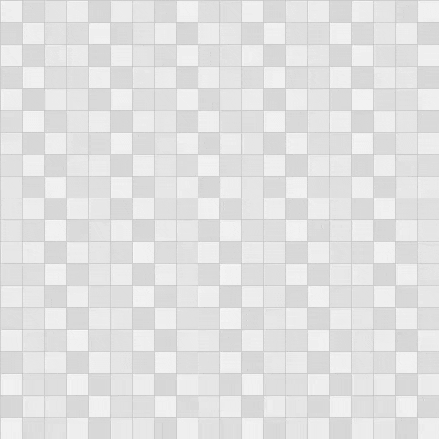
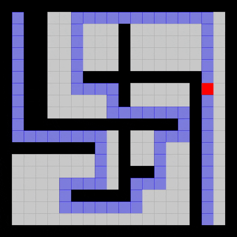
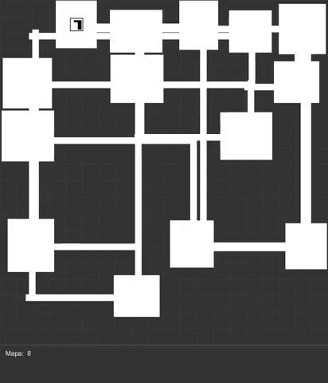

# Compilado-processing

Aqui tem alguns programas que eu fiz na IDE de interface gráfica Processing, alguns códigos estão completos outros não

## Calculo de rotas

Usando calculo heuristico dentro de uma matriz limitada (19 linhas x19 colunas) o código me mostra no console o melhor caminho de um ponto a se seguir dado um começo e dado um final

Em 99 estão todos os obstaculos, 0 é o objetivo e todos os outros valores são os pesos caso a partícula saia daquele ponto e queira chegar no objetivo. Se o ponto tem peso 35 ele obrigatoriamente percorrerá 35 casas até chegar no objetivo

## Robot Tracking

Aplicação gráfica do cálculo de rotas em um ambiente onde o robô se movimenta apenas em uma matriz

Em preto temos os obstáculos e o robô em vermelho se desloca do começo até o fim do que seria um dos melhores percussos para ele percorrer

## Manipulação de matriz

Uma simples biblioteca onde tenho as mais variadas formas de fazer contas com matrizes, entre elas multiplicar duas matriz, calcular sua transposta, fazer sua soma e calcular sua inversa

## Simple Dungeon Generator

Inspirado no estilo dos mapas de persona 3 eu fui capaz de gerar diversos mapas aleatórios, a intenção era fazer o robo se movimentar de um ponto aleatório desse mapa até a escada (retangulo com um L preto dentro) que levaria para um mapa mais profundo

Aqui tenho que fazer uma menção ao [coding cookies](http://www.codingcookies.com/2012/08/07/procedurally-generating-dungeons/), pois de lá tirei o código para gerar esses caminhos automáticos

## Movimentação do robô

***Código incompleto***

Devido a complexidade que o código tomou e minha não tanta habilidade com código na época não consegui finalizar o que seria a junção de todos os códigos que seria a movimentação do robô em duas dimensões de maneira contínua e desviando dos obstáculos e gerando mapas aleatórios também, o resultado do código pode ser visto abaixo

